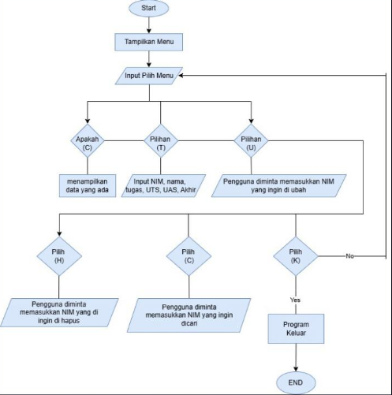

# input dan output dari pratikum 5
## input
``` python
def tampilkan_menu():
    print("\n[(L)ihat, (T)ambah, (U)bah, (H)apus, (C)ari, (K)eluar]:")

def tampilkan_daftar_nilai(daftar_nilai):
    if not daftar_nilai:
        print("Daftar Nilai")
        print("=" * 66)
        print("| NO |    NIM    |     NAMA      | TUGAS  | UTS  | UAS  | AKHIR  |")
        print("=" * 66)
        print("|                       TIDAK ADA DATA                           |")
        print("=" * 66)
    else:
        print("Daftar Nilai")
        print("=" * 66)
        print("| NO |    NIM    |     NAMA      | TUGAS  | UTS  | UAS  | AKHIR  |")
        print("=" * 66)
        for i, data in enumerate(daftar_nilai, start=1):
            print(f"| {i:<2} | {data[0]:<8} | {data[1]:<13} | {data[2]:<6} | {data[3]:<4} | {data[4]:<4} | {data[5]:<6.2f} |")
        print("=" * 66)

def tambah_data(daftar_nilai):
    print("Tambahkan Data")
    nim = input("NIM: ")
    nama = input("Nama: ")
    tugas = float(input("Nilai Tugas: "))
    uts = float(input("Nilai UTS: "))
    uas = float(input("Nilai UAS: "))
    nilai_akhir = (tugas * 0.30 + uts * 0.35 + uas * 0.35) 
    daftar_nilai.append([nim, nama, tugas, uts, uas, nilai_akhir])
    print("Data berhasil ditambahkan.")

def ubah_data(daftar_nilai):
    tampilkan_daftar_nilai(daftar_nilai)
    index = int(input("Pilih nomor data yang ingin diubah: ")) - 1
    if 0 <= index < len(daftar_nilai):
        nim = input("NIM baru: ")
        nama = input("Nama baru: ")
        tugas = float(input("Nilai Tugas baru: "))
        uts = float(input("Nilai UTS baru: "))
        uas = float(input("Nilai UAS baru: "))
        nilai_akhir = (tugas * 0.30 + uts * 0.35 + uas * 0.35 ) 
        daftar_nilai[index] = [nim, nama, tugas, uts, uas, nilai_akhir]
        print("Data berhasil diubah.")
    else:
        print("Nomor tidak valid.")

def hapus_data(daftar_nilai):
    tampilkan_daftar_nilai(daftar_nilai)
    index = int(input("Pilih nomor data yang ingin dihapus: ")) - 1
    if 0 <= index < len(daftar_nilai):
        daftar_nilai.pop(index)
        print("Data berhasil dihapus.")
    else:
        print("Nomor tidak valid.")

def cari_data(daftar_nilai):
    nim = input("Masukkan NIM yang dicari: ")
    ditemukan = False
    for data in daftar_nilai:
        if data[0] == nim:
            print(f"Data ditemukan: NIM: {data[0]}, Nama: {data[1]}, Tugas: {data[2]}, UTS: {data[3]}, UAS: {data[4]}, Akhir: {data[5]:.2f}")
            ditemukan = True
            break
    if not ditemukan:
        print("Data tidak ditemukan.")

if __name__ == "__main__":
    daftar_nilai = []
    while True:
        tampilkan_menu()
        pilihan = input().lower()

        if pilihan == 'l':
            tampilkan_daftar_nilai(daftar_nilai)
        elif pilihan == 't':
            tambah_data(daftar_nilai)
        elif pilihan == 'u':
            ubah_data(daftar_nilai)
        elif pilihan == 'h':
            hapus_data(daftar_nilai)
        elif pilihan == 'c':
            cari_data(daftar_nilai)
        elif pilihan == 'k':
            print("Keluar dari program.")
            break
        else:
            print("Pilihan tidak valid")
```
## output
``` python

[(L)ihat, (T)ambah, (U)bah, (H)apus, (C)ari, (K)eluar]:
T
Tambahkan Data
NIM: 312410163
Nama: Uswatun Hasanah
Nilai Tugas: 97
Nilai UTS: 98
Nilai UAS: 98
Data berhasil ditambahkan.

[(L)ihat, (T)ambah, (U)bah, (H)apus, (C)ari, (K)eluar]:
L
Daftar Nilai
==================================================================
| NO |    NIM    |       NAMA        | TUGAS  | UTS  | UAS  | AKHIR  |
==================================================================
| 1  | 312410163 |  Uswatun Hasanah  | 97.0   | 98.0 | 98.0 | 97.70  |
==================================================================

[(L)ihat, (T)ambah, (U)bah, (H)apus, (C)ari, (K)eluar]:
K
Keluar dari program.
```
## flowchart



## Penjelasan 
- Fungsi : Setiap bagian yang diawali dengan def adalah sebuah fungsi. Fungsi ini memiliki tugas khusus, seperti menampilkan menu, menambahkan data, mengubah data, dan sebagainya.

- Daftar Nilai: Variabel daftar_nilai adalah sebuah list (daftar) yang digunakan untuk menyimpan data mahasiswa. Setiap data mahasiswa berupa list yang berisi NIM, nama, nilai tugas, UTS, UAS, dan nilai akhir.

- Perulangan: Program akan terus berjalan dalam sebuah perulangan while True sampai pengguna memilih untuk keluar. Di dalam perulangan ini, program akan menampilkan menu, meminta input dari pengguna, dan menjalankan fungsi yang sesuai dengan pilihan pengguna.

- tampilkan_menu(): Fungsi ini mencetak menu pilihan yang dapat dipilih pengguna.

- tampilkan_daftar_nilai(daftar_nilai): Fungsi ini mencetak daftar nilai mahasiswa yang ada dalam daftar_nilai. Jika daftar kosong, akan ditampilkan pesan "TIDAK ADA DATA".

- tambah_data(daftar_nilai): Fungsi ini menambahkan data mahasiswa baru ke dalam daftar_nilai. Pengguna akan diminta memasukkan NIM, nama, nilai tugas, UTS, dan UAS. Nilai akhir akan dihitung secara otomatis.

- ubah_data(daftar_nilai): Fungsi ini mengubah data mahasiswa yang sudah ada. Pengguna akan memilih data yang ingin diubah, kemudian memasukkan data baru.

- hapus_data(daftar_nilai): Fungsi ini menghapus data mahasiswa yang dipilih oleh pengguna.

- cari_data(daftar_nilai): Fungsi ini mencari data mahasiswa berdasarkan NIM. Jika data ditemukan, maka data tersebut akan ditampilkan.

## Cara Kerja Program
1. Program dimulai dengan membuat list kosong daftar_nilai untuk menyimpan data mahasiswa.
2. Program kemudian masuk ke dalam perulangan while True.
3. Di dalam perulangan, program akan:
- Menampilkan menu pilihan.
- Meminta pengguna untuk memilih salah satu opsi.
- Memanggil fungsi yang sesuai dengan pilihan pengguna.
4. Perulangan akan terus berulang sampai pengguna memilih opsi untuk keluar.
